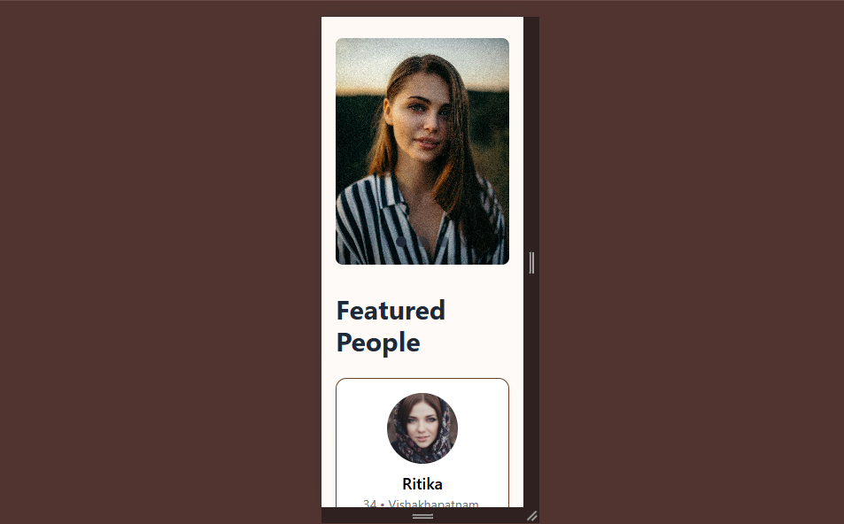
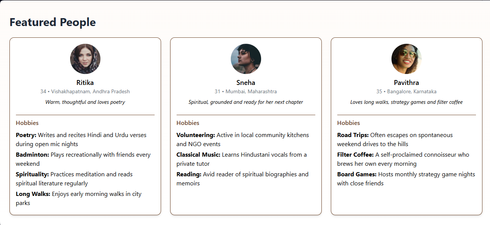
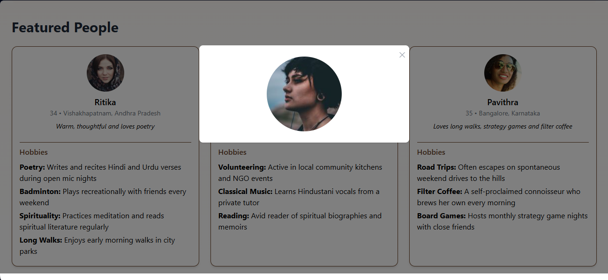

# Featured Profiles - Interactive Web Application

This project is a dynamic web application built to showcase a collection of featured profiles, complete with interactive elements and responsive design. It utilizes modern web technologies to provide a seamless user experience across various devices.

## 🌟 Project Overview

This application focuses on presenting profile information in an engaging and accessible manner. Key features include:

-   **Dynamic Carousel:** A visually appealing carousel at the top of the page, showcasing key messages and images.
-   **Interactive Profile Cards:** A grid of profile cards that display essential information and link to detailed views.
-   **Modal Detail View:** A modal that pops up when a profile card is clicked, providing a larger avatar and further details about the individual.
-   **Responsive Design:** The application adapts smoothly to different screen sizes, ensuring a consistent experience on desktops, tablets, and mobile devices.

## 🛠️ Technologies

-   **HTML:** For structuring the web page content.
-   **Tailwind CSS:** For fast and efficient styling, providing a responsive and modern look.
-   **Flowbite:** For pre-built UI components, enhancing the application's interactivity and design.
-   **JavaScript:** For dynamic content rendering, modal functionality, and interactive elements.

## 🚀 Getting Started

To view this project locally:

1.  Clone this repository to your local machine.
2.  Open the `index.html` file in your preferred web browser.

## 📂 Project Structure

-   `index.html`: The main HTML file containing the structure of the application.
-   `Screenshots/`: A directory containing screenshots of the application for visual reference.

## 💡 Key Features

-   **Carousel Presentation:** The carousel at the top of the page cycles through slides, providing a dynamic and visually engaging introduction.
-   **Profile Grid:** The profile grid displays a collection of featured individuals, each card providing a snapshot of their information.
-   **Interactive Modals:** Clicking on a profile card opens a modal, offering a more detailed view of the profile.
-   **Responsive Layout:** The application is designed to be responsive, adapting to various screen sizes for optimal viewing.
-   **JSON Data Integration:** The profile data is rendered dynamically from a JSON object, demonstrating data handling capabilities.

## 🖼️ Screenshots

### Desktop View

.png)

### Mobile View

### Featured People Section

### Avatar View

## 📝 Notes

This project demonstrates a solid understanding of frontend development principles, including responsive design, dynamic content rendering, and interactive UI elements. It serves as a showcase of skills in HTML, Tailwind CSS, Flowbite, and JavaScript.

---

**Crafted with ❤️ by Moon Sahu :)**
